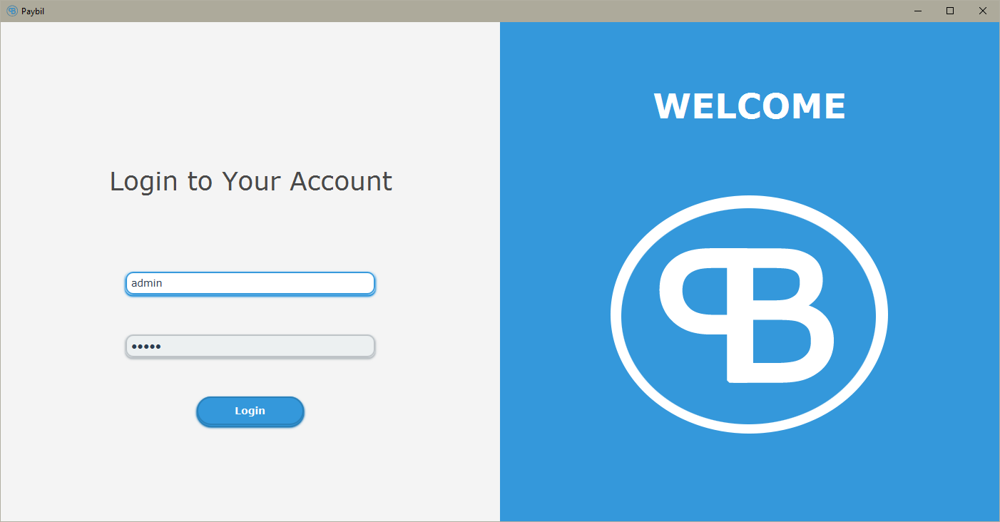
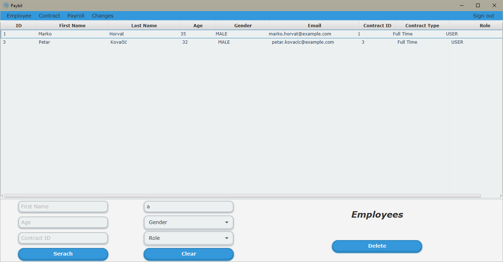
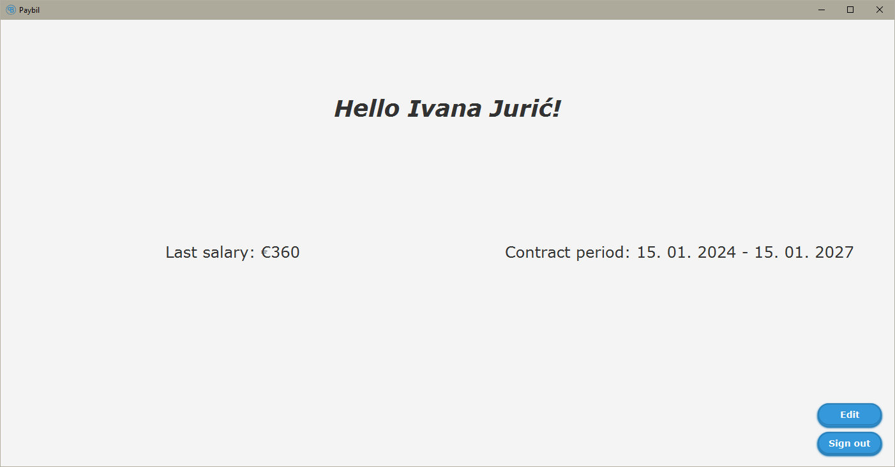

# PayBil

PayBil is a JavaFX application for calculating and managing worker salaries. It supports role-based access with admins and users, file and database storage, email notifications, and multi-threading for smooth operation.

---

## Features

- Manage workers with two roles: **Admin** and **User**  
- Admins access a special Admin screen; users have a limited User screen  
- Calculate salaries and track contracts  
- Send email notifications with background threads  
- Save and load data from text and binary files  
- Database integration using JDBC  
- Uses generic classes, serializers, and deserializers  
- Custom exceptions for validation and error handling  
- JavaFX UI styled with CSS  
- Application logs tracked with Logback  

---

## Setup

1. Place the configuration files directly in the project root folder.  
2. Create the following two files in the root folder:

- `database.properties`  
  ```properties
  databaseUrl = jdbc:h2:tcp://localhost/~/yourDatabaseName
  username = yourUsername
  password = yourPassword
  ```

- `email.properties`
  ```properties
  username = yourEmail@gmail.com
  password = yourAppPassword
  ```
> Use an app password (not your actual email password) for email sending.

3. Initialize the database by running the SQL script located at:  
 `/sql/database.sql`

---

## Usage

- Run the application using your Java IDE or command line.  
- Log in with a worker account.  
- **Default Admin login credentials:**  
  - Username: `admin`  
  - Password: `admin`  
- Admins and users see different screens based on their role.  
- Use the UI to manage employees, contracts, and send emails.

---

## Screenshots

### Login Screen  
The login screen allows users to enter their credentials. Depending on the role, users will be directed to either the Admin or User dashboard.



---

### Admin Dashboard  
Admins have access to a comprehensive dashboard where they can manage employees, contracts, and send email notifications.



---

### User Dashboard  
Users see a streamlined dashboard focused on their own salary and contract details.



## Project Structure

- Project root — configuration files (`database.properties`, `email.properties`)
- `src/` — source code  
- `sql/database.sql` — database initialization script  
- `resources/styles/app.css` — UI styling  
- `logs/application.log` — application logs  

---

## Technologies

- Java 17+  
- JavaFX (UI)  
- JDBC (database)  
- JavaMail (email)  
- Logback (logging)  
- Multithreading  
- Generics, abstract classes, interfaces, enums, exceptions  

---

## License

MIT License
